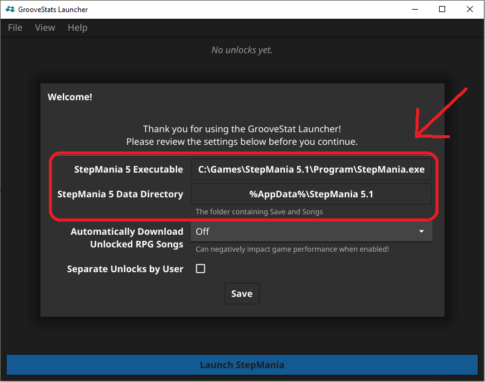

# GrooveStats Launcher

[](https://youtu.be/8yMzp7xMQq0)


## What is It?

The launcher allows StepMania themes to connect to
[GrooveStats](https://www.groovestats.com/) via its API. StepMania doesn't
allow themes to make network requests, so a separate program is required to do
that.

- For pad players only
- Has the following features:
  - Automatic score submission
  - Top scores and rivals in the songwheel
  - Leaderboards accessible via the menu
  - [SRPG](https://srpg5.groovestats.com/) integration, including
    auto-downloading unlocked songs
  - Hidden Dogecoin miner 🐕


## How to Install

- Install StepMania. Currently supported versions are 5.0, 5.1 beta 2 and 5.3
  (aka Outfox). If you use Outfox please make sure to use the latest alpha release.
- [Set up the Simply Love theme.](https://github.com/Simply-Love/Simply-Love-SM5#installing-simply-love)
  You will need version 5.0.0 or later. Older versions don't support
  GrooveStats features.

  [Digital Dance](https://github.com/Hayoreo/Digital-Dance/releases/latest)
  (1.0.0 or later) and
  [Waterfall](https://docs.google.com/document/d/1-13VfHKUM_b2WHZpQodrdLu3Pe-IWqrgJBBIHFq6y_Y)
  (0.7 or later) also have support for GrooveStats features.
- Install the launcher. There is a
  [Windows installer](https://github.com/GrooveStats/gslauncher/releases/latest/download/gslauncher-windows-setup.exe)
  and a
  [Linux tarball](https://github.com/GrooveStats/gslauncher/releases/latest/download/gslauncher-linux.tar.gz)
  with a setup script available.

  The installer for Windows is not signed, so you will have to click through a
  couple of security dialogs when running it.

  
  
  

  The Linux tarball contains binaries for the amd64 and i386 architectures. You
  can either just run the binaries by hand or you use the bundled setup script
  to install the launcher system-wide and add it to the application menu of you
  desktop environment.

  ```sh
  cd Downloads
  tar xzf gslauncher-linux.tar.gz
  cd gslauncher
  sudo ./setup.sh
  ```

  Check the settings after the first launch and adapt the path to your
  StepMania executable and to the data directory.

  

  You can also check out our
  [other download options](https://github.com/GrooveStats/gslauncher/releases/latest/)
  or
  [build the launcher yourself](https://github.com/GrooveStats/gslauncher/blob/main/doc/building.md).
- Enable local profiles in the theme settings if you haven't already.
  Alternatively, you can use USB profiles.
- You'll need to generate a `GrooveStats.ini` file in your profile folder. This
  can be done in one of two ways:
  - Enter the Music Select screen when logged into a profile. This will
    automatically generate the file for you.
  - Identify your LocalProfile, and manually create a `GrooveStats.ini` with
    the following contents:

    ```ini
    [GrooveStats]
    ApiKey=YOUR_API_KEY
    IsPadPlayer=1
    ```

  - IsPadPlayer=1 indicates that you are playing on a pad (and not a keyboard).
    If you're using a keyboard, then set this to 0. In that case your scores
    will not be submitted to GrooveStats, but other functionality will be
    active.

- To obtain your API key to make requests to the GrooveStats service, log into
  your GrooveStats account and visit the
  [Update Profile](https://groovestats.com/index.php?page=register&action=update)
  page to generate and copy your API key. Paste the API key after the `ApiKey=`
  in the `GrooveStats.ini` file.

  

- If you want the launcher to immediately launch StepMania after startup
  (useful for scripts) you can run it with the `-autolaunch` option. When using
  that option the launcher also automatically exits when StepMania has been
  closed and there are no pending unlocks.
 
- Still have questions or run into problems? Visit the
  [GrooveStats Discord](https://discord.gg/H7jYZ7xaEX) and ask for help.


## Links for Developers & Themers
- [Building the GrooveStats Launcher](https://github.com/GrooveStats/gslauncher/blob/main/doc/building.md)
- [Filesystem IPC](https://github.com/GrooveStats/gslauncher/blob/main/doc/fsipc.md):
  Description of the filesystem based protocol used to communicate between the
  Theme/StepMania and the GrooveStats Launcher.

Are you a theme developer who is interested in integrating the gslauncher into
your theme? Please [contact us](https://discord.gg/H7jYZ7xaEX) before doing so!
